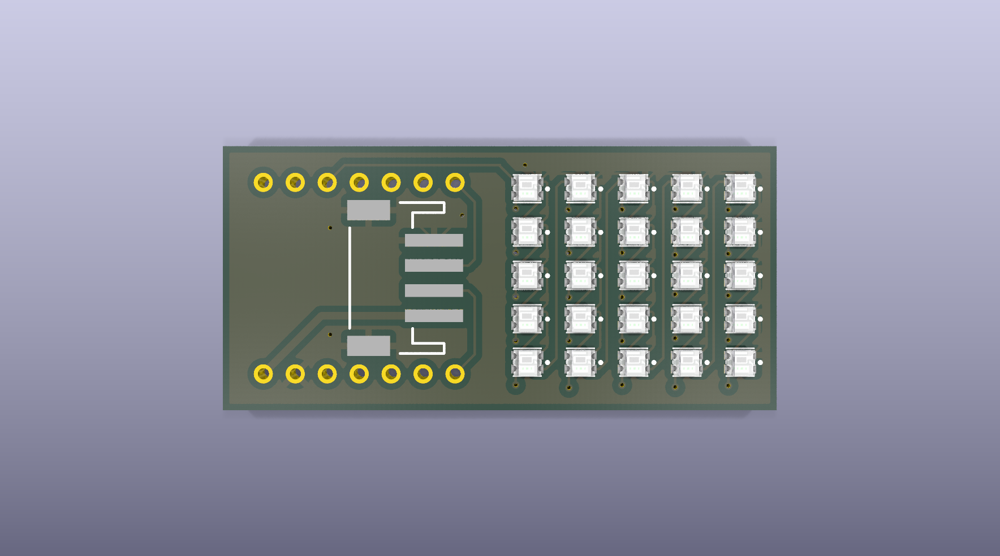
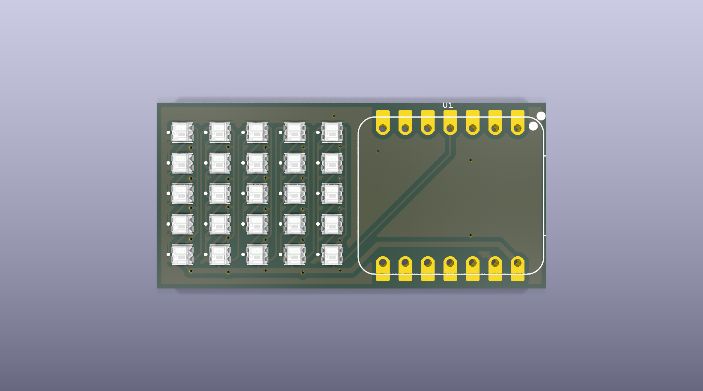
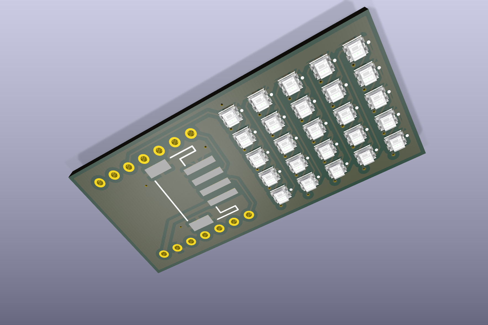
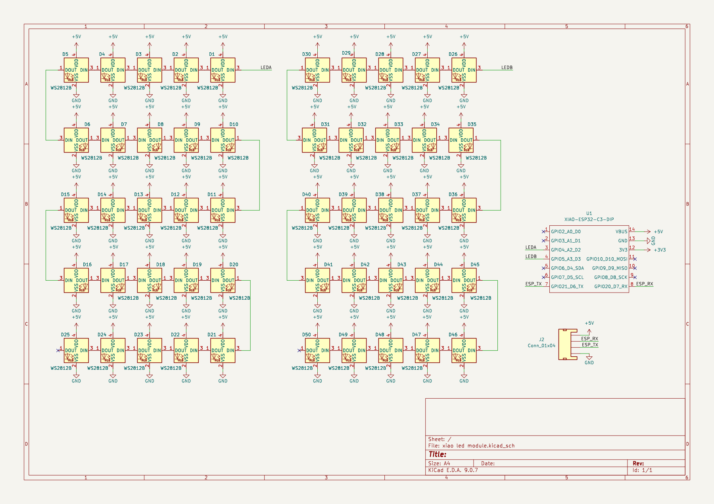
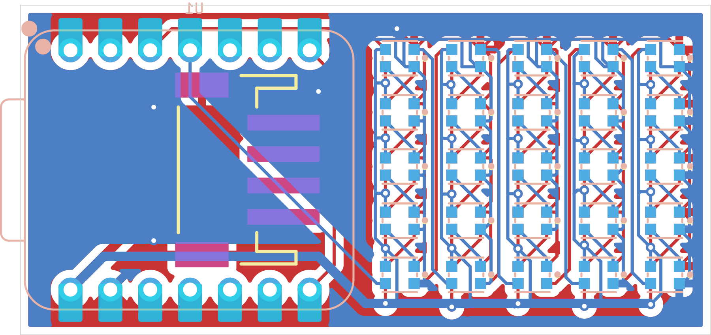

# XIAO LED Module

A 44 x 21 mm addressable-LED panel built around a **Seeed Studio XIAO
ESP32-C3**, driving **50 WS2812B-compatible RGB LEDs** (2020 package)
arranged as two 25-LED daisy chains, plus a 4-pin JST-PH connector for
external power/data breakout.

## 3D Renders

| Top side (LED array) | Bottom side (XIAO socket) |
|---|---|
|  |  |



## Schematic



Full-resolution vector version: [`docs/images/schematic.pdf`](docs/images/schematic.pdf)

## PCB Layout



*Copper (F.Cu / B.Cu), silkscreen, and solder mask layers, board outline shown.*

## Board Specs

- **Size:** 44.05 mm x 21.05 mm
- **Layers:** 2 (F.Cu / B.Cu)
- **MCU:** Seeed Studio XIAO ESP32-C3 (socketed, not soldered — see Manufacturing below)
- **LEDs:** 50x WS2812B-compatible addressable RGB LED, 2020 package,
  arranged as two independent 25-LED daisy chains (LEDA / LEDB) driven
  from separate GPIO pins
- **Power/data breakout:** J2, 4-pin JST-PH 2.0mm right-angle SMD connector
- **Power in:** +5V rail feeds the LED array; XIAO module handles its
  own onboard 3.3V regulation

## Bill of Materials

All parts verified against the live JLCPCB Open Platform API (real-time stock/pricing).

| Ref | Part | LCSC # | Library | Qty |
|---|---|---|---|---|
| D1-D50 | XL-2020RGBC-2812B (WS2812B-compatible RGB LED) | C5349955 | Extended | 50 |
| J2 | WAFER-PH2.0-4PWB (JST-PH-compatible 4-pin SMD connector) | C3029442 | Extended | 1 |
| U1 | Seeed XIAO ESP32-C3 | — | **Not JLCPCB-assembled, see below** | 1 |

### Part substitution notes

- **D1-D50 (LEDs):** the schematic's original part, WS2812B-2020
  (LCSC C965555), has only **4 units** in live JLCPCB stock — unusable
  for a 50-LED board. Replaced with **XL-2020RGBC-2812B (C5349955,
  127,770 in stock)** — confirmed via XINGLIGHT's datasheet to share
  the same 2.0x2.0mm package, the same VDD/GND/DI/DO pin-out, and
  WS2812 protocol compatibility. Direct drop-in on the existing
  `WS2812_2020` footprint.
- **J2 (connector):** the original part, JST S4B-PH-SM4-GW-TB
  (LCSC C265331), shows **0 units** in stock. Replaced with
  **WAFER-PH2.0-4PWB (C3029442, 45,426 in stock)** — same 4-pin,
  2.0mm-pitch, right-angle SMD JST-PH-compatible connector family,
  confirmed on the existing `JST_1x04_P2.0mm_Horizontal_SMD` footprint.
- **U1 (XIAO module):** the board footprint (`XIAO-ESP32-C3-DIP`) is a
  **socket pattern** — 14 pads in 2 rows at 2.54mm pitch, each with
  both a through-hole and an SMD land, designed so a plug-in XIAO
  module can be inserted rather than reflow-soldered. JLCPCB does not
  stock a machine-placeable 2.54mm female pin socket (a known
  limitation for tall THT sockets on their SMT assembly line), so **U1
  is marked DNP (Do Not Populate)** in the BOM/CPL. The board still
  gets the correct through-holes drilled; **hand-solder a standard
  1x7, 2.54mm female header pair into the U1 pads after fabrication**,
  then plug in your XIAO ESP32-C3.

## Manufacturing

`production/` contains regenerated, verified fabrication files:

- `xiao_led_module_gerbers.zip` — Gerbers + Excellon drill file
  (upload directly to JLCPCB's PCB order)
- `bom.csv` — JLCPCB-format BOM (Comment/Designator/Footprint/LCSC
  Part #) covering the 51 machine-assembled parts (50 LEDs + J2).
  **U1 is intentionally excluded** — see part substitution notes above.
- `positions.csv` — CPL / pick-and-place file, generated with
  `--exclude-dnp` so U1 is correctly omitted from placement while
  everything else retains accurate position/rotation/side data

### 3D view in KiCad

- **D1-D50 (LEDs):** the `WS2812_2020` footprint carries a real,
  present STEP model — renders correctly out of the box.
- **J2 (connector):** the SMD JST-PH "SM4" footprint family has **no
  3D model anywhere**, including KiCad's own upstream
  `kicad-packages3D` repo — a known gap in the official library, not
  something fixable from this repo. A through-hole JST-PH variant
  (`S4B-PH-K`, LCSC C157926, 18,711 in stock) *does* have a working
  model, but switching to it means a mechanical footprint change
  (SMD → THT); left as SMD per current board design.
- **U1 (XIAO module):** the footprint's bundled 3D models point at
  `${AMZPATH}`, a third-party model pack (from whoever originally
  authored this footprint) that isn't publicly distributed anywhere
  findable. Seeed's own official OPL KiCad library ships the
  *identical* footprint with the same broken reference. JLCPCB-side
  alternatives (direct XIAO ESP32-C3 module SKUs C19189385 and
  C18212168) are both essentially out of stock (0 and 1 units,
  respectively) regardless, so U1 was staying DNP either way — the
  missing 3D preview here is cosmetic only.

### Design Rule Check status

`kicad-cli pcb drc` reports 12 violations (4 starved-thermal errors on
zone-connected pads, plus silkscreen/track warnings) — all confirmed
**pre-existing** in the original committed board, unrelated to this
sourcing pass (verified via `git stash` diff-check: identical
violation set before and after the BOM/CPL changes). No new errors
introduced by the part substitutions.

## Repo Layout

```
xiao led module.kicad_pro   KiCad project
xiao led module.kicad_sch   Schematic
xiao led module.kicad_pcb   PCB layout
docs/images/                 Renders and diagrams (this README)
production/                   JLCPCB-ready fabrication output:
  xiao_led_module_gerbers.zip    Gerbers + drill (upload as-is)
  bom.csv                        JLCPCB BOM (50 LEDs + J2; U1 excluded, DNP)
  positions.csv                  CPL / pick-and-place file (DNP-excluded)
  gerbers/                       Individual Gerber/drill layer files
```
